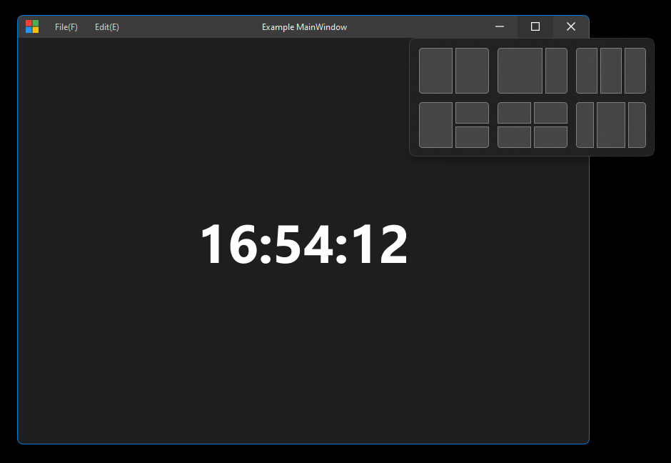
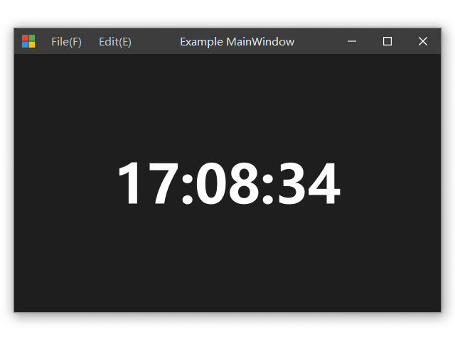
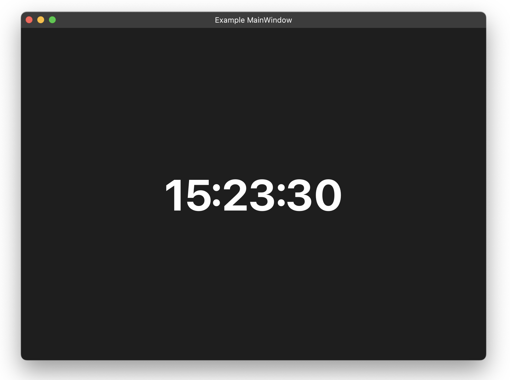
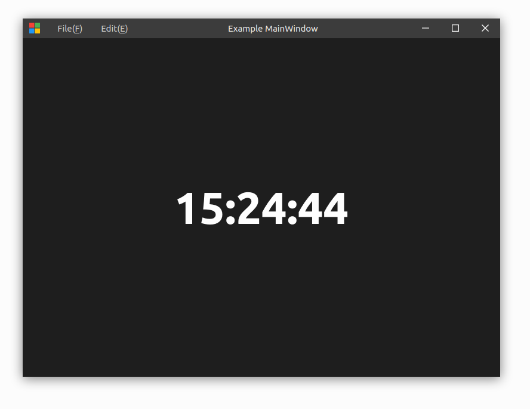

# QWindowKit

Cross-platform window customization framework for Qt Widgets and Qt Quick.

This project inherited the major implementations from [wangwenx190 FramelessHelper](https://github.com/wangwenx190/framelesshelper), with a complete refactoring and upgrading of the architecture.

Feature requests are welcome.

## Stay In Touch :triangular_flag_on_post:

You can share your findings, thoughts and ideas on improving / implementing QWindowKit functionalities on more platforms and apps!

- Chat with us on [Discord](https://discord.gg/grrM4Tmesy)
- 中文用户可加入 QQ 群 876419693

## Supported Platforms

- Microsoft Windows
- Apple macOS (11+)
- GNU/Linux

## Features

- Full support of Windows 11 Snap Layout
- Better workaround to handle Windows 10 top border issue
- Support Mac system buttons geometry customization
- Simpler APIs, more detailed documentations and comments

## Gallery

### Windows 11 (With Snap Layout)



### Windows 10 (And 7, Vista)



### macOS & Linux

|              macOS              |       Linux (Ubuntu 20.04)        |
|:-------------------------------:|:---------------------------------:|
|  |  |

## Requirements

| Component | Requirement |          Details          |
|:---------:|:-----------:|:-------------------------:|
|    Qt     |   \>=5.12   | Core, Gui, Widgets, Quick |
| Compiler  |  \>=C++17   |   MSVC 2019, GCC, Clang   |
|   CMake   |   \>=3.19   |   >=3.20 is recommended   |

Please read [Vulnerabilities](#Vulnerabilities) carefully to acquire detailed requirements.

### Tested Compilers

- Windows
    - MSVC: 2019, 2022
    - MinGW (GCC): 13.2.0
- macOS
    - Clang 14.0.3
- Ubuntu
    - GCC: 9.4.0

## Dependencies

- Qt 5.12 or higher
- [qmsetup](https://github.com/stdware/qmsetup)

## Integrate

### Build & Install

```sh
git clone --recursive https://github.com/stdware/qwindowkit
cd qwindowkit

cmake -B build -S . \
  -DCMAKE_PREFIX_PATH=<QT_DIR> \
  -Dqmsetup_DIR=<dir> \             # Optional
  -DQWINDOWKIT_BUILD_QUICK=TRUE \   # Optional
  -DCMAKE_INSTALL_PREFIX=/path/install \
  -G "Ninja Multi-Config"

cmake --build build --target install --config Debug
cmake --build build --target install --config Release
```
Read the root `CMakeLists.txt` for more build options.

You can also include this directory as a subproject if you choose CMake as your build system.

For other build systems, you need to install with CMake first and include the corresponding configuration files in your project.

### Import

#### CMake Project

```sh
cmake -B build -DQWindowKit_DIR=/path/install/lib/cmake/QWindowKit
```

```cmake
find_package(QWindowKit COMPONENTS Core Widgets Quick REQUIRED)
target_link_libraries(widgets_app PUBLIC QWindowKit::Widgets)
target_link_libraries(quick_app PUBLIC QWindowKit::Quick)
```

#### QMake Project

```cmake
# WidgetsApp.pro
include("/path/install/share/QWindowKit/qmake/QWKWidgets.pri")

# QuickApp.pro
include("/path/install/share/QWindowKit/qmake/QWKQuick.pri")
```

#### Visual Studio Project

See [Visual Studio Guide](./docs/visual-studio-guide.md) for detailed usages.

## Quick Start

### Qt Widgets Application

#### Initialization

The following initialization should be done before any widget constructs.

```cpp
#include <QtWidgets/QApplication>

int main(int argc, char *argv[])
{
    QGuiApplication::setAttribute(Qt::AA_DontCreateNativeWidgetSiblings)
    
    // ...
}
```

#### Setup Window Agent

First, setup `WidgetWindowAgent` for your top `QWidget` instance. (Each window needs its own agent.)

```c++
#include <QWKWidgets/widgetwindowagent.h>

MyWidget::MyWidget(QWidget *parent) {
    // ...
    auto agent = new QWK::WidgetWindowAgent(this);
    agent->setup(this);
    // ...
}
```

If you don't want to derive a new widget class or change the constructor, you can initialize the agent after the window
constructs.

```c++
auto w = new MyWidget();
auto agent = new QWK::WidgetWindowAgent(w);
agent->setup(w);
```

You should call `QWK::WidgetWindowAgent::setup()` as early as possible, especially when you need to set the size constrains. QWindowKit will change some Qt internal data which will affect how Qt calculates the window size, and thus you need to let QWindowKit initialize at the very beginning.

#### Construct Title bar

Then, construct your title bar widget, without which the window lacks the basic interaction feature, and it's better to
put it into the window's layout.

You can use the [`WindowBar`](examples/shared/widgetframe/windowbar.h) provided by `WidgetFrame` in the examples as the
container of your title bar components.

Let `WidgetWindowAgent` know which widget the title bar is.

```c++
agent->setTitleBar(myTitleBar);
```

Next, set system button hints to let `WidgetWindowAgent` know the role of the child widgets, which is important for the
Snap Layout to work.

```c++
agent->setSystemButton(QWK::WindowAgentBase::WindowIcon, myTitleBar->iconButton());
agent->setSystemButton(QWK::WindowAgentBase::Minimize, myTitleBar->minButton());
agent->setSystemButton(QWK::WindowAgentBase::Maximize, myTitleBar->maxButton());
agent->setSystemButton(QWK::WindowAgentBase::Close, myTitleBar->closeButton());
```

Doing this does not mean that these buttons' click events are automatically associated with window actions, you still need to manually connect the signals and slots to emulate the native window behaviors.

On macOS, this step can be skipped because it is better to use the buttons provided by the system.

Last but not least, set hit-test visible hint to let `WidgetWindowAgent` know which widgets are willing to receive mouse events.

```c++
agent->setHitTestVisible(myTitleBar->menuBar(), true);
```

The rest region within the title bar will be regarded as the draggable area for the user to move the window, and thus any QWidgets inside it will not receive any user interaction events such as mouse events/focus events/etc anymore, but you can still send/post such events to these widgets manually, either through Qt API or system API.

- If you want to disable window maximization, you can remove the `Qt::WindowMaximizeButtonHint` flag from the window.

<!-- #### Window Attributes (Experimental)

On Windows 11, you can use this API to enable system effects.

```c++
agent->setWindowAttribute("mica", true);
```

Available keys: `mica`, `mica-alt`, `acrylic`, `dark-mode`. -->

### Qt Quick Application

#### Initialization

Make sure you have registered `QWindowKit` into QtQuick:

```cpp
#include <QWKQuick/qwkquickglobal.h>

int main(int argc, char *argv[])
{
    // ...
    QQmlApplicationEngine engine;
    // ...
    QWK::registerTypes(&engine);
    // ...
}
```

#### Setup Window Components

Then you can use `QWindowKit` data types and classes by importing its URI:

```qml
import QtQuick 2.15
import QtQuick.Window 2.15
import QWindowKit 1.0

Window {
    id: window
    visible: false // We hide it first, so we can move the window to our desired position silently.
    Component.onCompleted: {
        windowAgent.setup(window)
        window.visible = true
    }
    WindowAgent {
        id: windowAgent
        // ...
    }
}
```

You can omit the version number or use "auto" instead of "1.0" for the module URI if you are using Qt6.

As we just mentioned above, if you are going to set the size constrains, please do it after `windowAgent.setup()` is called.

### Learn More

See [examples](examples) for more demo use cases. The examples have no High DPI support.

- QWindowKit Internals [TODO]
- [FramelessHelper Related](docs/framelesshelper-related.md)


### Vulnerabilities

#### Qt Version
- To achieve better frameless functionality, QWindowKit depends heavily on Qt's internal implementation. However, there are many differences in different versions of Qt, and earlier versions of Qt5 and Qt6 have many bugs which make it extremely difficult for QWindowKit to workaround without changing the Qt source code.
- And also due to limited manpower, although QWindowKit can be successfully compiled on Qt 5.12 or later, it can hardly work perfectly on all Qt versions.
- Therefore, the following Qt version ranges are recommended, if there are any exceptions with QWindowKit in your application, make sure the Qt version you use is in the ranges before raising the issue.
    - Qt 5: 5.15.2 or higher
    - Qt 6: 6.6.2 or higher (the newer, the better)

#### Hot Switch
- Once you have made the window frameless, it will not be able to switch back to the system frame again unless you destroy your window and recreate it with different settings.

#### Native Child Widget
- If you are about to add a widget with `Qt::WA_NativeWindow` property enabled as a descendent of the frameless window, you should enable `Qt::WA_DontCreateNativeAncestors` of it in advance.

#### Size Constrains
- If you want to disable window resizing, you can set a fixed size, which is officially supported by QWindowKit. If you use other special means to achieve this, QWK doesn't guarantee everything can still be fully functional.
- If you set a maximized width or height, the window should not be maximized because you cannot get the correct window size through Qt APIs. You may workaround this by using system APIs such as `GetWindowRect` or `GetClientRect`. The root cause lies deep in Qt QPA implementations and currently we don't know how to fix it without modifying Qt itself.

#### Windows 10
- Due to the inherent defects in the Windows 10 window system, the top border will disappear when the system title bar is removed. We have filtered Qt's event and perfectly reshown the system top border, thanks to the implementation of Windows Terminal for our reference. However, this workaround only works with QtWidgets and QtQuick (**only when rendering through D3D**) applications.
- In QtQuick applications that use OpenGL or other rendering backends, we use Qt's painting system to emulate this border. But since Windows 10 system border is translucent, the difference from the system border is more noticeable in a dark background.

## TODO

- Fix mouse cursor mapping issues
- More documentations
- When do we support Linux native features?

## Special Thanks

- [Maplespe](https://github.com/Maplespe)
- [zhiyiYo](https://github.com/zhiyiYo)

## License

QWindowKit is licensed under the [Apache 2.0 License](./LICENSE).

<!--

**You MUST keep a copyright notice of QWindowKit in a prominent place on your project, such as the README document and the About Dialog.**

**You MUST NOT remove the license text from the header files and source files of QWindowKit.**

-->
