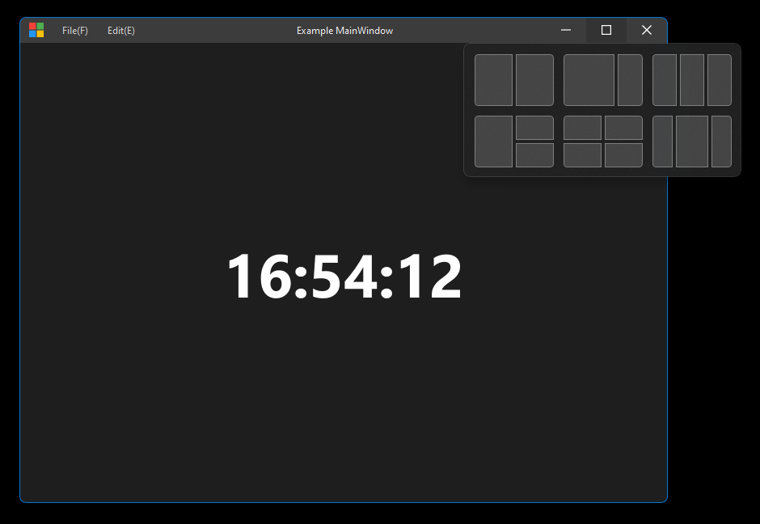
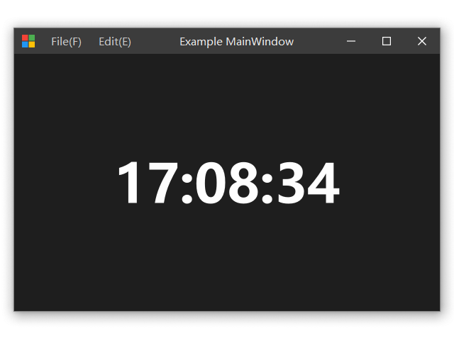
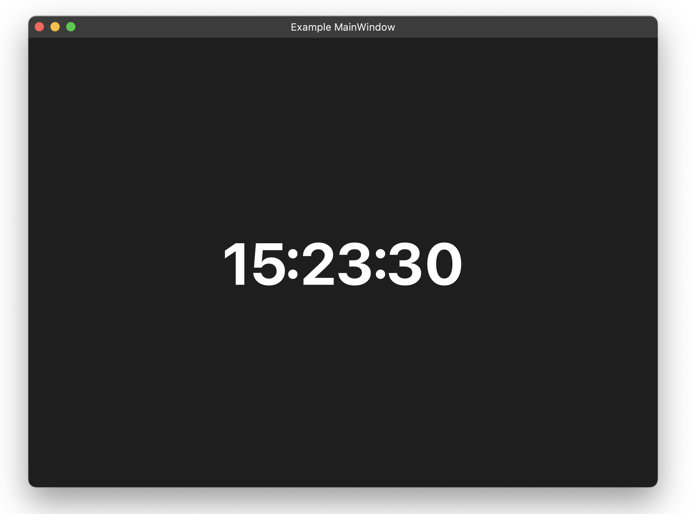
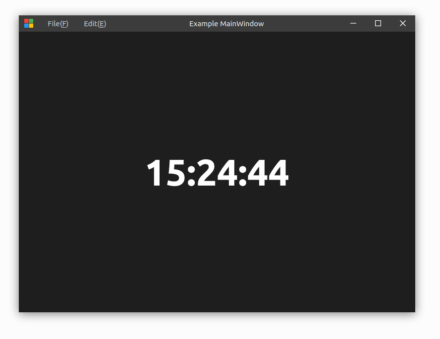

# QWindowKit

**Language:** English | [简体中文](./README.zh-CN.md)

**Tutorials:** [English tutorial](./docs/tutorial.en-US.md) | [简体中文教程](./docs/tutorial.zh-CN.md)

QWindowKit is a cross-platform window customization framework for Qt Widgets and Qt Quick. It helps applications replace the native title bar with a custom title bar while preserving important system behaviors such as window moving, resizing, system menus, and Windows Snap Layout.

The project inherits the core ideas and part of the implementation lineage from [wangwenx190 FramelessHelper](https://github.com/wangwenx190/framelesshelper), with a refactored architecture and a smaller API surface.

## Features

- Custom title bar support for Qt Widgets and Qt Quick.
- Windows 11 Snap Layout support when system button roles are configured.
- Windows 10/11 frameless window handling with optional system border workarounds.
- macOS native system button positioning and optional blur or glass-style effects.
- Linux fallback implementation with partial native system menu support on Qt 6 Wayland/X11.
- CMake package exports, qmake integration files, and Visual Studio property files.

## Supported Platforms

- Microsoft Windows.
- Apple macOS 11 or later.
- GNU/Linux.

## Screenshots

### Windows 11



### Windows 10



### macOS



| Default | Glass - regular |
|:--:|:--:|
|  |  |
| Glass - clear | Glass - regular, rounded |
|  |  |
| Glass - regular, dark tint | Glass - regular, light tint |
|  |  |
| Legacy - dark blur | Legacy - light blur |
|  |  |

### Linux



## Requirements

| Component | Requirement | Notes |
|:--|:--|:--|
| Qt | 5.12 or later | Qt Core and Gui are required. Widgets and Quick are optional modules. |
| C++ | C++17 or later | Tested with MSVC, GCC, and Clang. |
| CMake | 3.19 or later | CMake 3.20 or later is recommended. |

Recommended Qt versions:

- Qt 5: 5.15.2 or later.
- Qt 6: 6.6.2 or later.

QWindowKit uses Qt private APIs and platform-specific windowing behavior. Older Qt releases may compile but can have known or unknown runtime issues.

Tested compilers:

- Windows: MSVC 2019, MSVC 2022, MinGW GCC 13.2.0.
- macOS: Clang 14.0.3.
- Ubuntu: GCC 9.4.0.

## Modules

| Module | Target | Purpose |
|:--|:--|:--|
| Core | `QWindowKit::Core` | Shared platform window infrastructure. |
| Widgets | `QWindowKit::Widgets` | Integration for `QWidget` and `QMainWindow`. |
| Quick | `QWindowKit::Quick` | Integration for `QQuickWindow` and QML `Window`. |

`QWINDOWKIT_BUILD_WIDGETS` is enabled by default. `QWINDOWKIT_BUILD_QUICK` is disabled by default and must be enabled explicitly when you need Qt Quick support.

## Build And Install

Clone the repository with submodules:

```sh
git clone --recursive https://github.com/stdware/qwindowkit
cd qwindowkit
```

Configure, build, and install:

```sh
cmake -S . -B build \
  -DCMAKE_PREFIX_PATH=<QT_DIR> \
  -DCMAKE_INSTALL_PREFIX=<INSTALL_DIR> \
  -DQWINDOWKIT_BUILD_WIDGETS=ON \
  -DQWINDOWKIT_BUILD_QUICK=ON

cmake --build build --config Release
cmake --install build --config Release
```

Common build options:

| Option | Default | Description |
|:--|:--|:--|
| `QWINDOWKIT_BUILD_STATIC` | `OFF` | Build static libraries instead of shared libraries. |
| `QWINDOWKIT_BUILD_WIDGETS` | `ON` | Build the Widgets module. |
| `QWINDOWKIT_BUILD_QUICK` | `OFF` | Build the Quick module. |
| `QWINDOWKIT_BUILD_EXAMPLES` | `OFF` | Build examples. |
| `QWINDOWKIT_BUILD_DOCUMENTATIONS` | `OFF` | Build Doxygen documentation. |
| `QWINDOWKIT_INSTALL` | `ON` | Generate install targets and package files. |
| `QWINDOWKIT_FORCE_QT_WINDOW_CONTEXT` | `OFF` | Force the pure Qt fallback implementation. |
| `QWINDOWKIT_ENABLE_WINDOWS_SYSTEM_BORDERS` | `ON` | Enable Windows system border workarounds. |
| `QWINDOWKIT_ENABLE_STYLE_AGENT` | `ON` | Build the style/theme helper. |

`qmsetup` is required. If CMake cannot find an installed `qmsetup` package, the bundled submodule is used automatically.

## Integrate With Your Project

### CMake

Configure your application with the installed package path:

```sh
cmake -S . -B build -DQWindowKit_DIR=<INSTALL_DIR>/lib/cmake/QWindowKit
```

Widgets application:

```cmake
find_package(Qt6 REQUIRED COMPONENTS Core Gui Widgets)
find_package(QWindowKit REQUIRED COMPONENTS Widgets)

target_link_libraries(my_widgets_app PRIVATE
    Qt6::Core
    Qt6::Gui
    Qt6::Widgets
    QWindowKit::Widgets
)
```

Quick application:

```cmake
find_package(Qt6 REQUIRED COMPONENTS Core Gui Quick Qml)
find_package(QWindowKit REQUIRED COMPONENTS Quick)

target_link_libraries(my_quick_app PRIVATE
    Qt6::Core
    Qt6::Gui
    Qt6::Quick
    Qt6::Qml
    QWindowKit::Quick
)
```

QWindowKit can also be added as a CMake subdirectory when it is vendored into your project.

### qmake

After installing QWindowKit with CMake, include the generated `.pri` file:

```qmake
# Widgets
include("<INSTALL_DIR>/share/QWindowKit/qmake/QWKWidgets.pri")

# Quick
include("<INSTALL_DIR>/share/QWindowKit/qmake/QWKQuick.pri")
```

### Visual Studio

For MSBuild projects, see [Visual Studio Guide](./docs/visual-studio-guide.md).

## Quick Start: Qt Widgets

Set `Qt::AA_DontCreateNativeWidgetSiblings` before constructing `QApplication`:

```cpp
#include <QtCore/QCoreApplication>
#include <QtWidgets/QApplication>

int main(int argc, char *argv[])
{
    QCoreApplication::setAttribute(Qt::AA_DontCreateNativeWidgetSiblings);

    QApplication app(argc, argv);
    // Create and show your main window.
    return app.exec();
}
```

Install `WidgetWindowAgent` on each top-level widget that needs a custom frame:

```cpp
#include <QWKWidgets/widgetwindowagent.h>

MainWindow::MainWindow(QWidget *parent)
    : QMainWindow(parent)
{
    auto *agent = new QWK::WidgetWindowAgent(this);
    agent->setup(this);

    auto *titleBar = new QWidget(this);
    setMenuWidget(titleBar);

    agent->setTitleBar(titleBar);
}
```

Register system button roles so that native behaviors such as Windows Snap Layout can work:

```cpp
agent->setSystemButton(QWK::WindowAgentBase::WindowIcon, iconButton);
agent->setSystemButton(QWK::WindowAgentBase::Minimize, minimizeButton);
agent->setSystemButton(QWK::WindowAgentBase::Maximize, maximizeButton);
agent->setSystemButton(QWK::WindowAgentBase::Close, closeButton);
```

Connect button behavior yourself:

```cpp
connect(minimizeButton, &QPushButton::clicked, this, &QWidget::showMinimized);
connect(maximizeButton, &QPushButton::clicked, this, [this] {
    isMaximized() ? showNormal() : showMaximized();
});
connect(closeButton, &QPushButton::clicked, this, &QWidget::close);
```

Mark interactive controls inside the title bar as hit-test visible:

```cpp
agent->setHitTestVisible(menuBar, true);
agent->setHitTestVisible(searchBox, true);
```

Areas inside the title bar that are not hit-test visible are treated as draggable window space.

## Quick Start: Qt Quick

Register the QML types before loading your QML:

```cpp
#include <QtGui/QGuiApplication>
#include <QtQml/QQmlApplicationEngine>
#include <QtQuick/QQuickWindow>

#include <QWKQuick/qwkquickglobal.h>

int main(int argc, char *argv[])
{
    QQuickWindow::setDefaultAlphaBuffer(true);

    QGuiApplication app(argc, argv);

    QQmlApplicationEngine engine;
    QWK::registerTypes(&engine);
    engine.load(QUrl(QStringLiteral("qrc:/Main.qml")));

    return app.exec();
}
```

Use `WindowAgent` from QML:

```qml
import QtQuick
import QtQuick.Controls
import QtQuick.Window
import QWindowKit 1.0

Window {
    id: window
    width: 900
    height: 600
    visible: false

    WindowAgent {
        id: windowAgent
    }

    Rectangle {
        id: titleBar
        anchors.top: parent.top
        width: parent.width
        height: 40
    }

    Component.onCompleted: {
        windowAgent.setup(window)
        windowAgent.setTitleBar(titleBar)
        window.visible = true
    }
}
```

In Qt 6, the import version can be omitted if your QML style allows unversioned imports.

## Platform Attributes

`WindowAgentBase::setWindowAttribute()` exposes platform-specific features. Unsupported attributes return `false`.

Windows examples:

```cpp
agent->setWindowAttribute(QStringLiteral("dark-mode"), true);
agent->setWindowAttribute(QStringLiteral("mica"), true);
agent->setWindowAttribute(QStringLiteral("mica-alt"), false);
agent->setWindowAttribute(QStringLiteral("acrylic-material"), false);
agent->setWindowAttribute(QStringLiteral("dwm-blur"), false);
agent->setWindowAttribute(QStringLiteral("dwm-border-color"), QColor("#3367d6"));
```

macOS examples:

```cpp
agent->setWindowAttribute(QStringLiteral("no-system-buttons"), false);
agent->setWindowAttribute(QStringLiteral("blur-effect"), QStringLiteral("dark"));
agent->setWindowAttribute(QStringLiteral("glass-effect"), QStringLiteral("regular"));
agent->setWindowAttribute(QStringLiteral("glass-corner-radius"), 24.0);
agent->setWindowAttribute(QStringLiteral("glass-tint-color"), QColor(255, 255, 255, 46));
```

See [the English tutorial](./docs/tutorial.en-US.md) for more complete examples.

## Important Notes

### Qt Version Compatibility

QWindowKit relies on Qt private implementation details to provide better frameless behavior. The project may compile with older Qt versions, but unsupported Qt versions can still have runtime issues caused by Qt internals or platform plugins.

Use Qt 5.15.2+ or Qt 6.6.2+ when possible.

### Setup Timing

Call `setup()` as early as possible, preferably near the beginning of the top-level window constructor. If you need minimum, maximum, or fixed size constraints, apply them after QWindowKit has been set up.

### Runtime Frame Switching

Do not switch back to the native system frame at runtime. Recreate the window if your application needs to change between native and custom frames.

Do not call `QWidget::setWindowFlags()` to change window flags after `WidgetWindowAgent::setup()`.

### Native Child Widgets

If a child widget uses `Qt::WA_NativeWindow`, enable `Qt::WA_DontCreateNativeAncestors` before creating native ancestors.

### Size Constraints

Fixed-size windows are supported. Avoid maximizing a window with a constrained maximum width or height, because Qt may not report the native maximized geometry correctly.

### Windows 10 And Qt Quick

The Windows 10 top border workaround works for Qt Widgets and for Qt Quick when rendering through OpenGL, D3D11, or D3D12. Vulkan has known limitations.

For Qt Quick with D3D11/D3D12, a white line may appear at the top of the window on some configurations. With Qt 6.7 or later, setting `QT_QPA_DISABLE_REDIRECTION_SURFACE=1` before creating `QCoreApplication` may help. Do not enable that variable for OpenGL or Vulkan.

## Documentation

- [English tutorial](./docs/tutorial.en-US.md)
- [Simplified Chinese tutorial](./docs/tutorial.zh-CN.md)
- [Visual Studio Guide](./docs/visual-studio-guide.md)
- [FramelessHelper Related](./docs/framelesshelper-related.md)
- [Examples](./examples)

## Community

- Discord: <https://discord.gg/grrM4Tmesy>
- QQ group for Chinese users: 876419693

## Acknowledgements

- [Maplespe](https://github.com/Maplespe)
- [zhiyiYo](https://github.com/zhiyiYo)

## License

QWindowKit is licensed under the [Apache License 2.0](./LICENSE).
