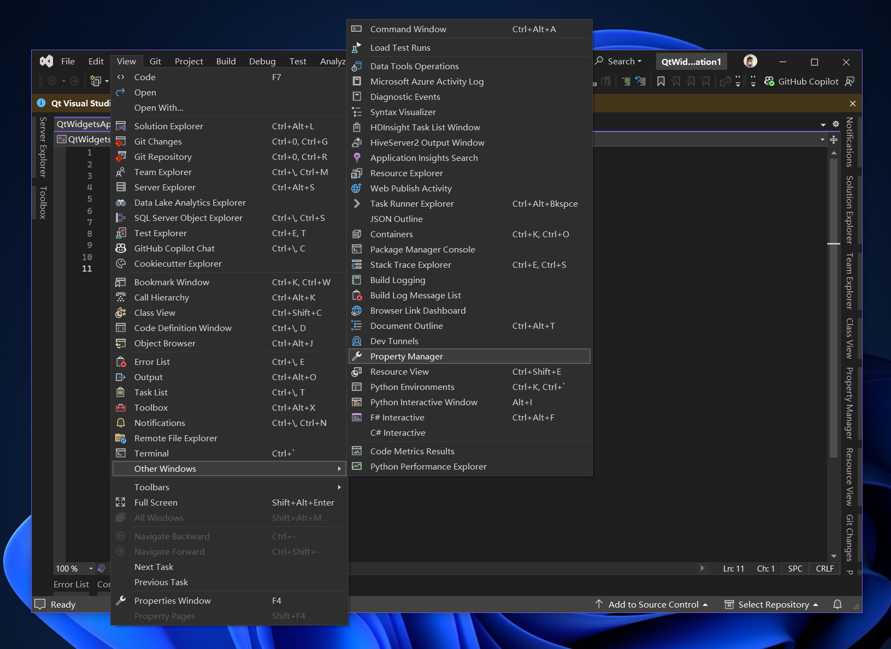
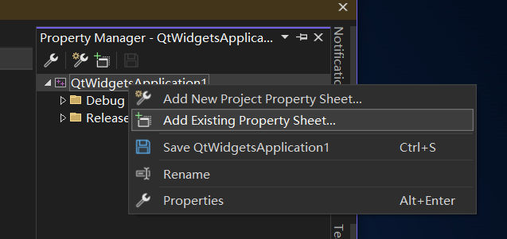

# Visual Studio Guide

First, click the "View" menu, find "Other Windows", click "Property Manager".

Then, right click the project name item and pop up a context menu, click "Add
Existing Property Sheet...".

Finally, find the "QWindowKit.props" in the "[Build output folder of
QWindowKit]\share\QWindowKit" folder, click "Open" button.